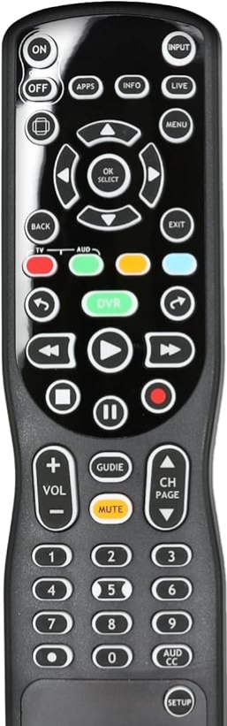
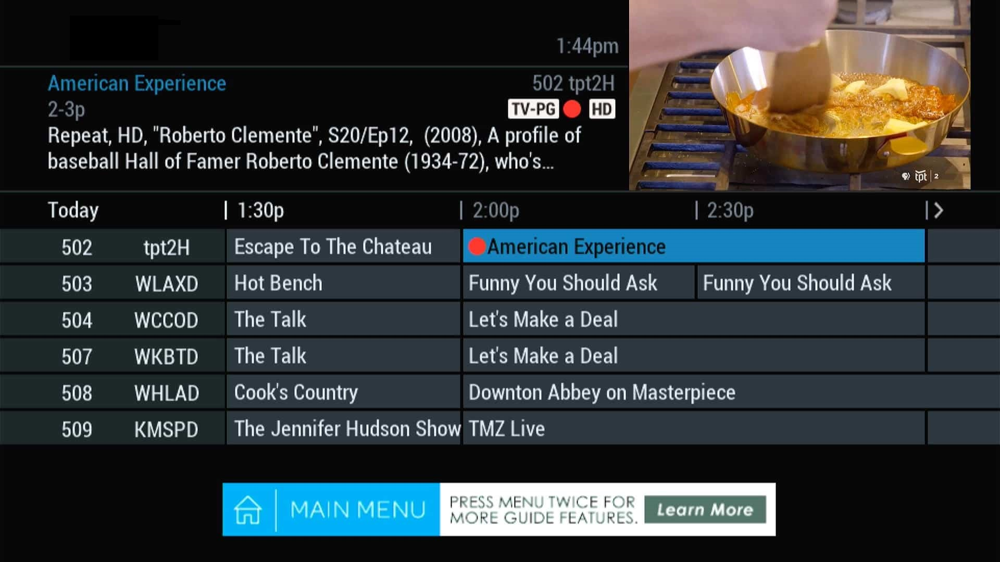

# DVR Operations: Playback and Recording

This tutorial provides a foundational overview of using your Digital Video Recorder (DVR). In the sections below, you will find instructions on how to use standard playback controls for saved content and the specific steps required to record television programming.

---

## Section 1: DVR Playback Controls

To manage your viewing experience, use the playback cluster on your remote control to navigate through recorded media with precision.

| Control | Icon | Action |
| :--- | :---: | :--- |
| **Play** | ? | Starts or resumes playback of the selected recording. |
| **Stop** | ? | Ends playback and returns you to the main recordings menu. |
| **Pause** | ? | Temporarily freezes the video on the current frame. |
| **Fast-Forward** | ? | Advances the video quickly. Press multiple times to toggle speed. |
| **Rewind** | ? | Reverses the video. Press multiple times to toggle speed. |
| **Record** | ? | Capture the selected source (for further instructions, go to Section 2). |  

---

## Section 2: Recording a TV Show

You can capture your favorite programs to watch later by following these steps to initiate a recording.

### Steps to Record:

1. **Locate your program**: Open the on-screen **Guide** and use the arrow keys to highlight the show you wish to record.
2. **Start the recording**: Press the **Record (?)** button on your remote control. 
3. **Confirm the schedule**: 
    * If the show is currently airing, a recording icon will appear on the screen.
    * If the show is scheduled for later, select **Confirm** in the pop-up menu to save the time slot.
